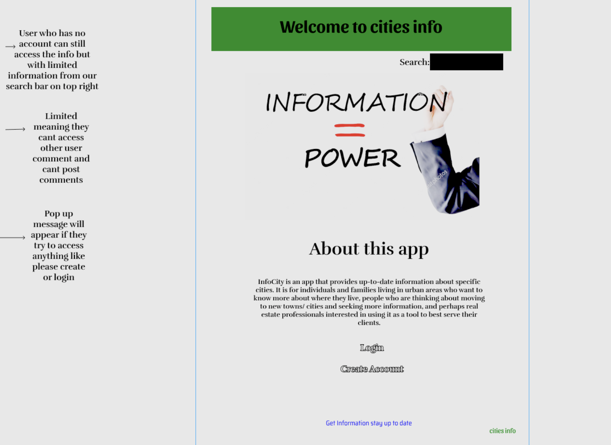
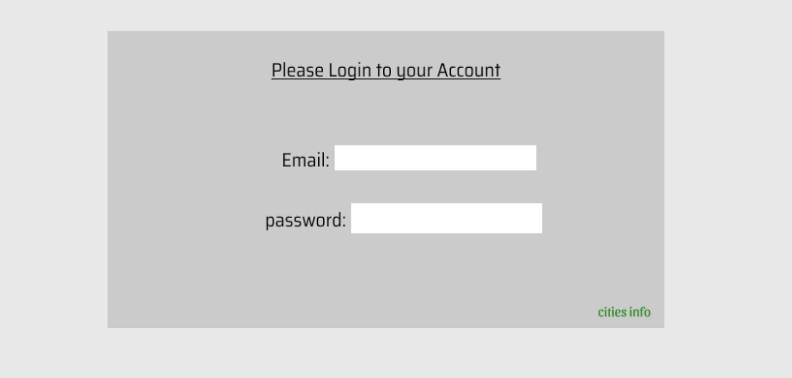
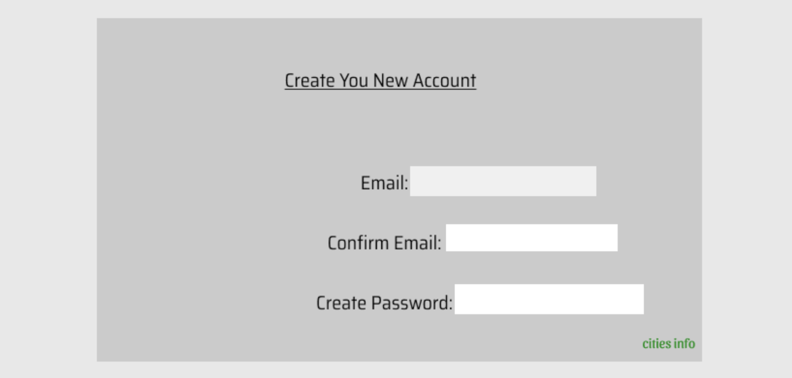
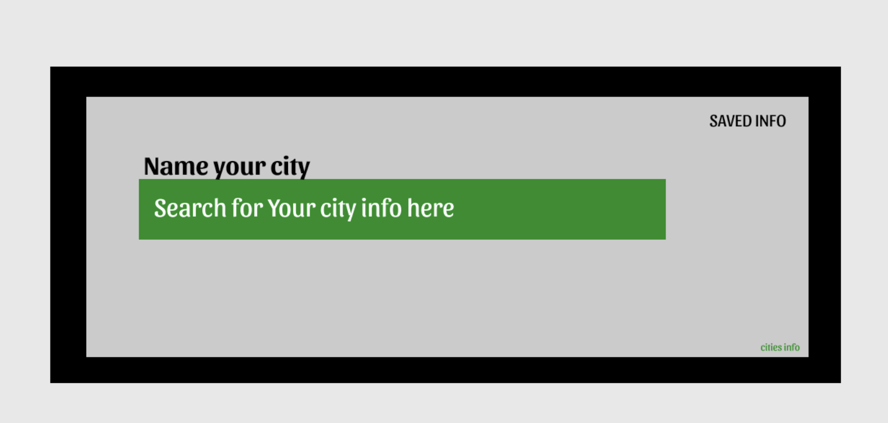
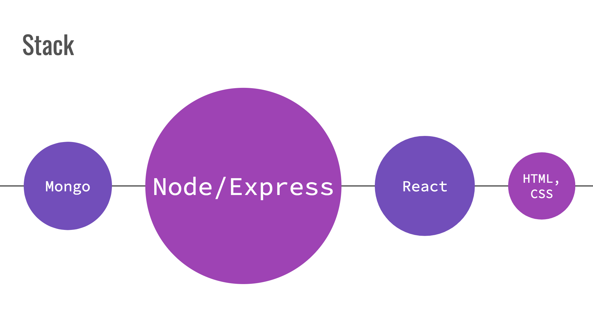
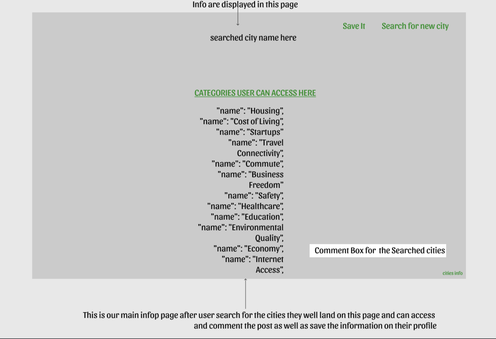
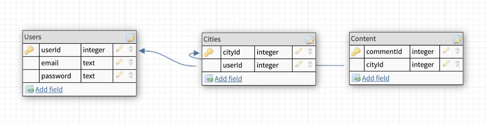

# Info City
***

### **Info City** is an app that helps you decide where to live next or even enjoy their next vacation ' users. The recommendation is based on a set of parameters
1. Economy
2. Environmental Quality
3. User location
4. Cost of Living
5. Housing
### The app is based off of the [Teleport](https://developers.teleport.org/) API

**Wireframes**
**User stories**
#### App users
- User(s) are able to open the app and run city searches
-  User(s) able to what information I will see when I search for a city.
- User(s) view information on specified cities based on defined parameters.
- User(s) can make personal experience statement when they visit a city  after creating an account.
- enjoy life to it's fullest

**Technologies used (including APIs)**

- This is a MERN app that fetches data using the [Teleport](https://developers.teleport.org/) API's resources that are provided via Json
- Database - MongoDB.
- Node.js ORM - Mongoose
**MVP goals**
---
- Setup app with requests to API
- Ability to create user account and login
- Adding user comments about city
**Stretch goals**

#### Many are possible

---
- Ability to Search for movies
- Email notification - To let users know who wins
- Saving user info to db via user accounts

---
## **Database ERD:**

---

**RESTful routing chart**
---
**Installation**
- npm install
